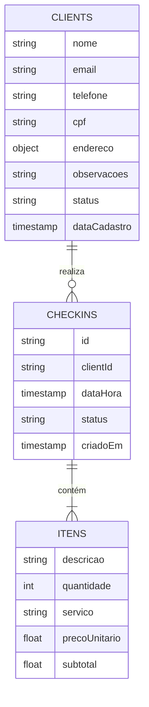
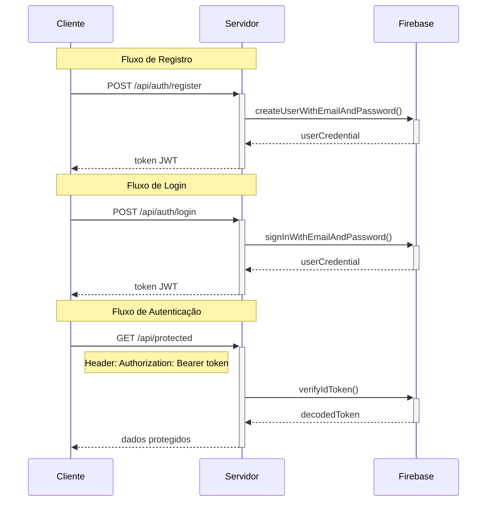

# Documentação do Sistema de Autenticação com Firebase

## Índice
1. [Conceitos Básicos](#conceitos-basicos)
   - [Estrutura de Collections](#estrutura-de-collections)
   - [Fluxo de Autenticação](#fluxo-de-autenticacao)

2. [Implementação](#implementacao)
   - [Endpoints](#endpoints)
   - [Validações](#validacoes)
   - [Relacionamentos](#relacionamentos)

3. [Segurança](#seguranca)
   - [Regras de Segurança](#regras-de-seguranca)
   - [Autenticação](#autenticacao)
   - [Validações](#validacoes)

4. [Testes](#testes)
   - [Testes Unitários](#testes-unitarios)
   - [Testes de Integração](#testes-de-integracao)
   - [Testes de Autenticação](#testes-de-autenticacao)

## Conceitos Básicos

### Estrutura de Collections



### Fluxo de Autenticação



## Implementação

### Endpoints

```javascript
// authController.js
const register = async (req, res) => {
    try {
        const { email, password } = req.body;
        
        const user = await admin.auth().createUser({
            email,
            password,
        });

        const token = await admin.auth().createCustomToken(user.uid);
        
        res.json({ token });
    } catch (error) {
        res.status(400).json({ message: error.message });
    }
};

const login = async (req, res) => {
    try {
        const { email, password } = req.body;
        
        const user = await admin.auth().getUserByEmail(email);
        const token = await admin.auth().createCustomToken(user.uid);
        
        res.json({ token });
    } catch (error) {
        res.status(400).json({ message: error.message });
    }
};
```

### Validações

```javascript
// authMiddleware.js
const authenticate = async (req, res, next) => {
    try {
        const token = req.headers.authorization?.split(' ')[1];
        
        if (!token) {
            return res.status(401).json({ message: 'Token não fornecido' });
        }

        const decoded = await admin.auth().verifyIdToken(token);
        req.client = await Client.findOne({ email: decoded.email });
        next();
    } catch (error) {
        res.status(401).json({ message: 'Token inválido ou expirado' });
    }
};
```

### Relacionamentos

```javascript
// Client Model
export class Client {
    constructor({
        nome,
        email,
        telefone,
        cpf,
        endereco = {},
        dataCadastro = new Date().toISOString(),
        observacoes = "",
        status = "ativo"
    }) {
        this.nome = nome;
        this.email = email;
        this.telefone = telefone;
        this.cpf = cpf;
        this.endereco = {
            rua: endereco.rua || "",
            numero: endereco.numero || "",
            bairro: endereco.bairro || "",
            cidade: endereco.cidade || "",
            estado: endereco.estado || "",
            cep: endereco.cep || "",
            complemento: endereco.complemento || ""
        };
        this.dataCadastro = dataCadastro;
        this.observacoes = observacoes;
        this.status = status;
    }
}
```

## Segurança

### Regras de Segurança

```javascript
// securityRules.js
rules_version = '2';
service cloud.firestore {
    match /databases/{database}/documents {
        match /{document=**} {
            allow read, write: if request.auth != null;
        }
    }
}
```

### Autenticação

```javascript
// firebase.js
const admin = require('firebase-admin');
const serviceAccount = require('./serviceAccountKey.json');

admin.initializeApp({
    credential: admin.credential.cert(serviceAccount)
});

module.exports = admin;
```

## Testes

### Testes Unitários

```javascript
// testAuth.js
const axios = require('axios');

async function testAuth() {
    try {
        // Registro
        const registerResponse = await axios.post('http://localhost:3000/api/auth/register', {
            email: 'usuario@teste.com',
            password: 'senha123'
        });
        
        const token = registerResponse.data.token;
        
        // Login
        const loginResponse = await axios.post('http://localhost:3000/api/auth/login', {
            email: 'usuario@teste.com',
            password: 'senha123'
        });
        
        // Acesso a rota protegida
        const protectedResponse = await axios.get('http://localhost:3000/api/protected', {
            headers: { Authorization: `Bearer ${token}` }
        });
        
        console.log(protectedResponse.data);
    } catch (error) {
        console.error(error.response?.data || error.message);
    }
}
```

## Boas Práticas

1. **Segurança**
   - Use HTTPS para todas as comunicações
   - Implemente validação de dados no servidor
   - Configure regras de segurança no Firebase
   - Limite tentativas de login

2. **Gerenciamento de Dados**
   - Mantenha backups regulares
   - Use índices para consultas frequentes
   - Implemente limpeza automática de dados antigos
   - Monitore o uso de armazenamento

3. **Performance**
   - Cache tokens de autenticação
   - Use paginamento para listagens
   - Otimize consultas comuns
   - Implemente índices nos campos frequentemente consultados


O diagrama acima mostra os três fluxos principais:

Registro: O cliente envia dados para criar uma nova conta
Login: O cliente se autentica com suas credenciais
Autenticação: O cliente usa o token JWT para acessar recursos protegidos